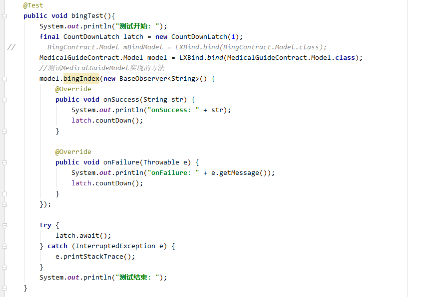

# LXNetWork
基于OkHttp+Retrofit+RxJava封装的网络框架
自动Model层生成模板代码
使用简单
示例程序这里我就省略Presenter随便写了一下你可以根据你自己的需求来。

**1、引入该模块**

```
    'com.github.lrhcoyote.LXNetWork:network:v1.0.0.4'
    implementation 'com.github.lrhcoyote.LXNetWork:LXAnnotation:v1.0.0.4'
    implementation 'com.github.lrhcoyote.LXNetWork:LXBind:v1.0.0.4'
    annotationProcessor "com.github.lrhcoyote.LXNetWork:LXCompiler:v1.0.0.4"
```

**2、初始化网络在Application中添加**

`LXHttp.init(new NetworkConfig());`

**3、创建自己的网络请求接口**

添加@BaseUrl或@TestUrl为你请求的路径

```
@BaseUrl(ApiConstants.MEDICAL_GUIDE_URL)
public interface MedicalGuideApi {

    @POST("/guide/getGuideListByCategoryId")
    Observable<String> getGuideListByCategoryId(@Body RequestBody requestBody);
    
    @GET("guide/v2/{id}")
    Observable<String> getGuideDetDetails(@Path("id") Integer id);
}
```

**4、model层的定义**
注意：model里面的方法必须在你的网络请求接口中存在

```
@LXModel(value = "MedicalGuideModel", networkEngine = MedicalGuideNetwork.class, networkService = MedicalGuideApi.class)
 @LXModelImpl(MedicalGuideModel.class) //被忽略的实现
 interface Model {
 
   void getGuideListByCategoryId(RequestBody requestBody, BaseObserver baseObserver);
   
   Observable<String> getGuideDetDetails(Integer id);
   
   @Ignore
   void bingIndex(BaseObserver observer);
 }
```
**注意：如果方法不存在MedicalGuideApi中请添加@Ignore注解。如果你必须要这个方法你可以添加@LXModelImpl注解去实现被@Ignore注解忽略的实现，！！！！添加实现的类不能与接口定义在一个包内，见下图**


**自定义Model实现如下：**

```
public class MedicalGuideModel {
    //添加@Ignore忽略的实现
    public void bingIndex(BaseObserver baseObserver){
        LXHttp.getInstance().createService(BingApi.class)
                .bingIndex()
                .compose(LrhHttp.getInstance().applySchedulers(baseObserver));
    }
}
```
**说明：@LXModel 用于生成模板代码
      value 生成代码的名称
      networkEngine 用于发起网络请求的类 必须继承LXHttp或继承BaseHttp，还可以实现INetWorkRequest接口。
      networkService 网络请求接口
      @LXModelImpl 自定义实现网络请求方法   LXModelImpl注解**

如果你不满意想自己封装网络库也是可以的，必须继承LXHttp，BaseHttp或实现INetWorkRequest接口，以上实现你都必须有一个getInstance()方法，返回当前实现的单例。
比如：
```
public class TestNetWork extends BaseHttp {

    private static TestNetWork testHttp = new TestNetWork();

    public static TestNetWork getInstance(){
        return testHttp;
    }

    @Override
    public Retrofit createRetrofit(Class service) {
        return null;
    }

    @Override
    public OkHttpClient createOkHttpClient() {
        return null;
    }
    
    @Override
    public Interceptor createInterceptor() {
        return null;
    }

    @Override
    public <T> Function<T, T> createAppErrorHandler() {
        return null;
    }
    //内网https绕过可能需要得到
    @Override
    public OkHttpClient.Builder bypassHttps(OkHttpClient.Builder build) {
        return null;
    }
}
```
**5、使用LXBind.bind方法进行绑定，如下图**


联系作者：QQ  758648178
