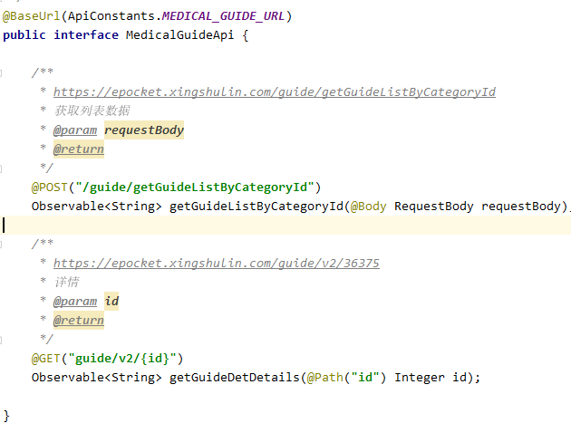
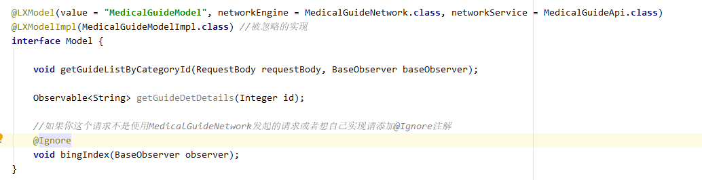
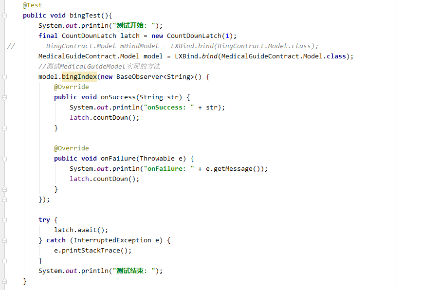

# LXNetWork
基于OkHttp+Retrofit+RxJava封装的网络框架
自动Model层生成模板代码
使用简单
示例程序这里我就省略Presenter随便写了一下你可以根据你自己的需求来。

1、引入该模块

    implementation 'com.github.lrhcoyote.LXNetWork:network:v1.0.0.4'
    implementation 'com.github.lrhcoyote.LXNetWork:LXAnnotation:v1.0.0.4'
    implementation 'com.github.lrhcoyote.LXNetWork:LXBind:v1.0.0.4'
    annotationProcessor "com.github.lrhcoyote.LXNetWork:LXCompiler:v1.0.0.4"

2、初始化网络在Application中添加

`LrhHttp.init(new NetworkConfig());`

3、创建自己的网络请求接口

添加@BaseUrl或@TestUrl为你请求的路径

4、model层的定义
注意：model里面的方法必须在你的网络请求接口中存在

如果方法不存在请添加@Ignore注解，如上图：
添加@LXModelImpl注解说明被@Ignore注解 Ignore注解忽略的方法的实现类忽略的方法的实现类，实现的方法名与参数必须与添加@Ignore注解的方法名参数一致。

** 注意：@LXModelImpl注解里class的名称不能与@LXModel里value的值一样  
    比如@LXModel(value = "TestModel") @LXModelImpl("TestModel")  这样的不行以后会添加这种支持
**

说明：@LXModel 用于生成模板代码
      value 生成代码的名称
      networkEngine 用于发起网络请求的类 必须继承LrhHttp或继承BaseHttp如果是继承BaseHttp请添加getService方法。
      networkService 网络请求接口

      @LXModelImpl 自定义实现网络请求方法   LXModelImpl注解

5、使用LXBind.bind方法进行绑定，如下图

